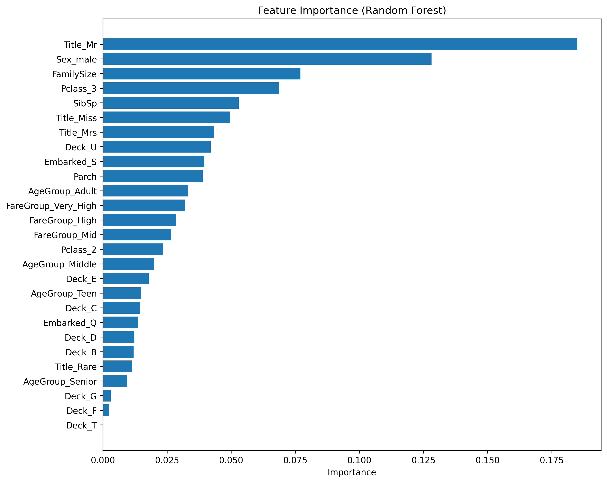

# Titanic Survival Prediction

## Objective
Build machine learning models to predict passenger survival on the Titanic dataset from Kaggle.

## Approach

### 1. Data Preprocessing
- Handled missing values:
  - Age filled using median grouped by Pclass and Sex
  - Embarked filled with mode
  - Fare filled with median
- Dropped irrelevant features: Name, Ticket, Cabin

### 2. Feature Engineering
- Extracted **Title** from passenger names and grouped rare titles
- Created **FamilySize** from SibSp and Parch
- Extracted **Deck** from Cabin
- Applied binning:
  - Age → AgeGroup
  - Fare → FareGroup
- One-hot encoding applied to categorical variables

### 3. Model Training

Two models were implemented and compared:

- **Logistic Regression**
- **Random Forest Classifier**

Evaluation was performed using **Stratified K-Fold Cross Validation (k=10)**.

## Results

| Model                | Accuracy (CV) |
|---------------------|--------------|
| Logistic Regression | ~0.827       |
| Random Forest       | ~0.824       |

## Model Selection

The final model is selected based on cross-validation performance:

- If Random Forest performs better → use Random Forest  
- Otherwise → use Logistic Regression  

## Feature Importance

Although Logistic Regression may be selected as the final model,  
**Random Forest is used to analyze feature importance**.

Key influential features include:
- Title
- Sex
- Pclass
- FamilySize

## Learnings

- Importance of feature engineering in improving model performance  
- Trade-offs between simple models (Logistic Regression) and complex models (Random Forest)  
- Using cross-validation for robust evaluation  
- Interpreting models using feature importance  

## Outputs

- Generates `feature_importance_chart.png` as Feature Importance Chart
- Generates `submission.csv` for Kaggle competition
